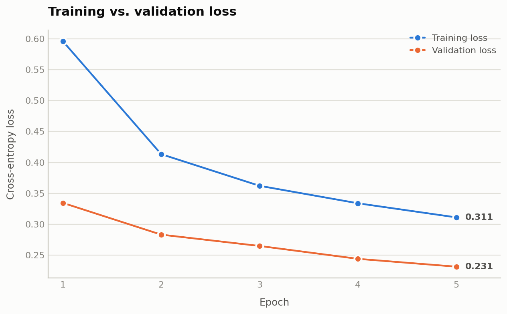

AI Coding Labs
==============

A set of small PyTorch labs on FashionMNIST, where each lab is solved twice —
once with Claude (`*_claude.py`) and once with Codex (`*_codex.py`) — so the two
implementations of the same task can be read side by side.

Labs
----

| Lab | Contents |
| --- | --- |
| `lab0_first_contact` | Placeholder for the first-contact exercise (empty). |
| `lab1_data_pipeline` | A custom `Dataset` plus reproducible train/validation `DataLoader`s. See its own [README](lab1_data_pipeline/README.md). |
| `lab2_train` | Trains a small CNN on the lab 1 pipeline and plots train vs. validation loss to `loss_curves.png`. |

Both lab 1 variants build a seeded 48,000 / 12,000 split of the official
training set, keep the official test set for final evaluation, and give each
split its own transform pipeline (augmentation on train only). The Claude
variant holds the raw tensors in memory and augments on tensors; the Codex
variant wraps the torchvision dataset in indexed views.

Lab 2 imports the lab 1 pipeline rather than re-deriving it, so normalization
statistics stay fitted on the training split alone.

Setup
-----

```sh
python3 -m venv venv
source venv/bin/activate
python3 -m pip install -r lab1_data_pipeline/requirements.txt
python3 -m pip install matplotlib   # lab 2 only
```

Running
-------

```sh
# Lab 1: build the loaders (the first run downloads FashionMNIST into ./data)
cd lab1_data_pipeline
python3 lab1_data_claude.py
python3 lab1_data_codex.py

# Lab 2: train for 5 epochs and save the loss curves
cd ../lab2_train
python3 lab2_train_claude.py
python3 lab2_train_codex.py
```

Lab 2 picks CUDA, then MPS, then CPU, whichever is available first. Runs are
seeded with `SEED = 42`; batch size, learning rate, and epoch count sit at the
top of each training script.


